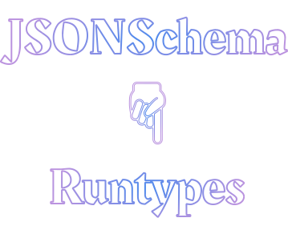

  
  
  Generate Runtypes from JSONSchema

This library aims to provide an intuitive and easy way to generate
[Runtypes][runtypes] types from JSONSchema, based on [generate-runtypes][] and
[ts-morph][].

We are thankful for all help with adding new functionality, fixing issues, or
improve the package. Feel free to open issues and pull requests ❤️

## Documentation

Apart from this README, you can find details and examples of using the SDK in
the following places:

- [API Documentation][docs]

## Thanks!

This library a fork of
[json-schema-to-typescript](https://github.com/bcherny/json-schema-to-typescript),
most of the work is done by the contributors of that library!

[runtypes]: https://github.com/pelotom/runtypes
[ts-morph]: https://github.com/dsherret/ts-morph
[docs]: ./docs
[generate-runtypes]: https://github.com/cobraz/generate-runtypes
